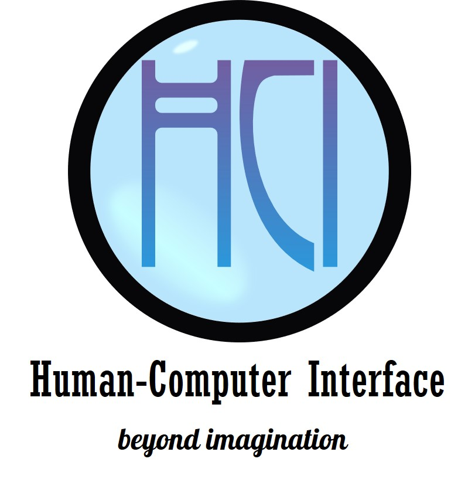

# Human-Computer Interface Lab

Human-Computer Interface Lab (HCI Lab) contributes on development of advanced intuitive interface technologies between human and computer/robot such as immersive virtual reality, augmented reality, teleoperation, and advanced human-robot interface for learning and assistive technology to improve human’s quality of life.

ห้องวิจัยด้านการเชื่อมต่อระหว่างมนุษย์และคอมพิวเตอร์ เน้นงานวิจัยและพัฒนาส่วนการติดต่อ (Interface) ทั้งทางด้านซอฟแวร์และฮาร์ดแวร์ เพื่อทำให้มนุษย์ผู้ใช้งานระบบคอมพิวเตอร์และหุ่นยนต์ให้ได้รับความสะดวกสบาย ง่ายและเป็นธรรมชาติมากที่สุด

## Official Website

- http://fibo.kmutt.ac.th/fibo/research/fibo-laboratory/hci-lab
- https://www.hcilab.net

## Social Network Service

https://www.facebook.com/hcilabFIBO
